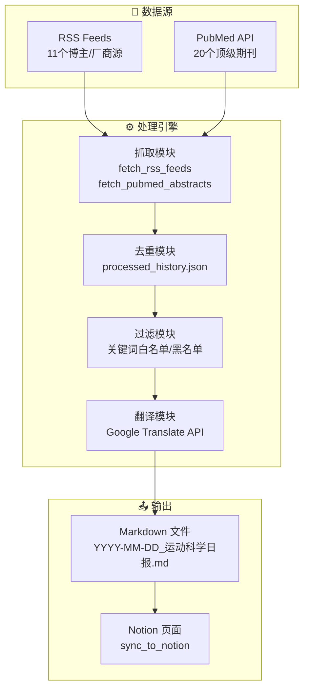
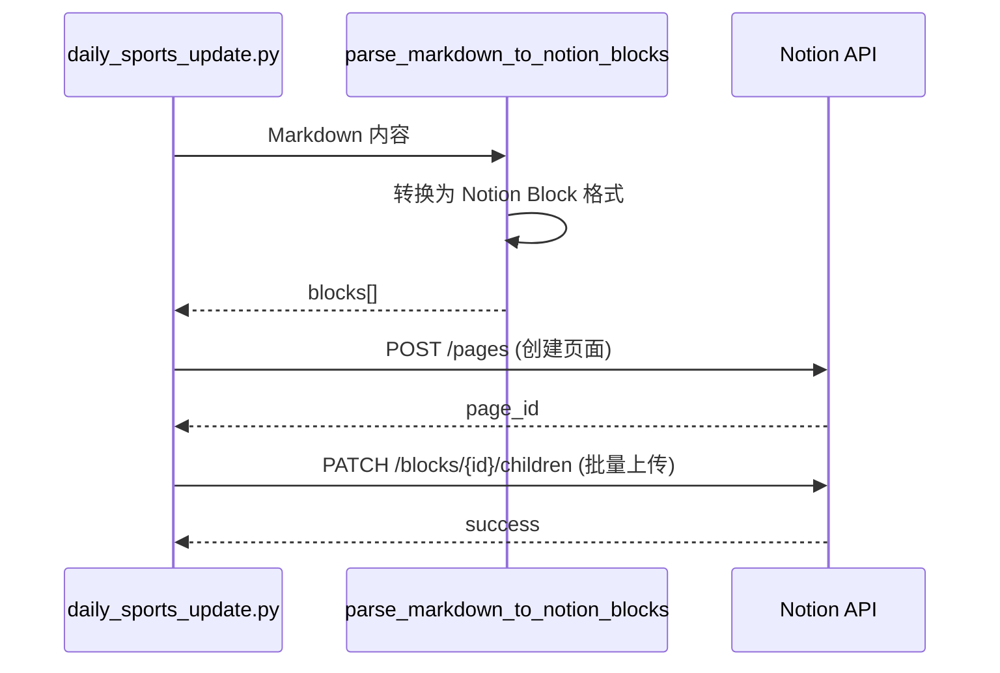

# 🏃‍♂️ 运动科学日报系统 - 产品文档

> **版本**: v3.1 | **最后更新**: 2026-02-09

---

## 📋 目录

1. [产品概述](#产品概述)
2. [系统架构](#系统架构)
3. [核心模块](#核心模块)
4. [数据源配置](#数据源配置)
5. [输出与同步](#输出与同步)
6. [AI Agent 技能](#ai-agent-技能)
7. [文件结构](#文件结构)
8. [配置参数](#配置参数)
9. [使用指南](#使用指南)

---

## 产品概述

**运动科学日报系统** 是一个自动化的运动科学信息聚合平台，专为运动科学专业人士、教练和研究者设计。

### 核心价值
| 功能 | 描述 |
|------|------|
| **双源情报** | 同时抓取 PubMed 顶级期刊论文 + RSS 行业新闻 |
| **智能去重** | 历史记录追踪，确保每日内容不重复 |
| **中文翻译** | 自动将英文摘要翻译成中文 |
| **Notion 同步** | 一键同步到 Notion 工作区 |
| **关键词过滤** | 智能筛选运动健康相关内容 |

---

## 系统架构



---

## 核心模块

### 1. 数据抓取层

| 函数 | 功能 | 输入 | 输出 |
|------|------|------|------|
| `fetch_rss_feeds()` | 抓取 RSS 源 | days, history_set | 分类内容字典 |
| `fetch_pubmed_abstracts()` | 抓取 PubMed | days, history_set | 论文列表 |

### 2. 数据处理层

| 函数 | 功能 |
|------|------|
| `translate_to_chinese()` | 调用 Google Translate 翻译 |
| `is_recent()` | 检查日期是否在回溯期内 |
| `load_history()` / `save_history()` | 管理去重历史 |

### 3. 内容过滤层

**白名单关键词** (55个): `health`, `fitness`, `hrv`, `recovery`, `sleep`, `wearable`, `athlete`...

**黑名单关键词** (35个): `phone`, `camera`, `car`, `movie`, `investment`...

**屏蔽主题** (PubMed): `surgery`, `cancer`, `rat`, `mice`, `cadaver`...

### 4. 输出层

| 函数 | 功能 |
|------|------|
| `generate_markdown()` | 生成三板块 Markdown 报告 |
| `parse_markdown_to_notion_blocks()` | 转换为 Notion API 格式 |
| `sync_to_notion()` | 上传到 Notion |

---

## 数据源配置

### 📝 博主/专家源 (11个)

| 来源 | 领域 |
|------|------|
| Stronger by Science (Nuckols) | 力量训练研究 |
| Mysportscience (Jeukendrup) | 运动营养 |
| Peter Attia | 长寿/代谢健康 |
| Andrew Huberman | 神经科学与表现 |
| Science for Sport | 运动表现 |
| YLMSportScience | 足球科学 |
| Bryan Johnson (Blueprint) | 抗衰老实验 |
| Jeff Nippard | 科学健身 |
| Renaissance Periodization | 训练方法论 |
| Andy Galpin | 人体表现 |
| JB Morin | 生物力学 |

### 🏭 行业/厂商源 (9个)

| 来源 | 领域 |
|------|------|
| DC Rainmaker | 可穿戴评测 |
| Google Research | 健康 AI |
| Whoop Podcast | 恢复科学 |
| Oura Engineering | 睡眠技术 |
| Fitbit (Google Blog) | 健康追踪 |
| Garmin Blog | 运动手表 |
| Polar Blog | 心率监测 |
| Oura Ring Blog | 戒指可穿戴 |
| Apple Newsroom | 健康技术 |

### 📚 PubMed 顶刊 (20个)

分为四大类：
- **运动医学/临床**: BJSM, AJSM, Sports Medicine, SJMSS...
- **生理学**: JAP, EJAP, JSCR, MSSE...
- **表现科学**: IJSPP, JSS, JSHS...
- **营养/行为**: IJSNEM, JISSN, IJBNPA, Nutrients

---

## 输出与同步

### Markdown 报告结构

```
# 🧬 运动科学日报 (Research Grade) - YYYY-MM-DD

## 1. 我喜欢的博主的动向
   - 博主更新内容 (翻译后)

## 2. 行业科研与技术工程
   - 厂商研发博客 (过滤后)

## 3. 科研进展 (PubMed 顶刊)
   - 论文摘要 (结构化翻译)
```

### Notion 同步流程



---

## AI Agent 技能

项目包含两个预配置的 AI Agent 技能：

### 1. `generate_daily_update`
**路径**: `.agent/skills/generate_daily_update/SKILL.md`

**功能**: 运行爬虫生成每日报告并同步到 Notion

### 2. `sync_to_notion`
**路径**: `.agent/skills/sync_to_notion/SKILL.md`

**功能**: 将本地 Markdown 文件上传到 Notion 页面

---

## 文件结构

```
agent 资讯/
├── 📄 daily_sports_update.py    # 核心爬虫脚本 (776行)
├── 📄 sync_report_to_notion.py  # Notion 同步工具
├── 📄 requirements.txt          # Python 依赖
├── 📄 .env                      # 环境变量 (Notion Token)
├── 📄 processed_history.json    # 去重历史 (自动生成)
│
├── 📁 .agent/skills/            # AI Agent 技能配置
│   ├── generate_daily_update/
│   └── sync_to_notion/
│
├── 📄 run_update.sh             # 一键运行脚本
├── 📄 setup_cron.sh             # 定时任务配置
│
├── 📄 YYYY-MM-DD_运动科学日报.md  # 每日生成的报告
├── 📄 2025_年度运动科学行业综述.md # 年度总结报告
│
└── 🔧 调试工具
    ├── check_links.py           # 链接验证
    ├── check_notion_access.py   # Notion 权限检查
    ├── debug_feeds.py           # RSS 源调试
    ├── test_core.py             # 核心功能测试
    └── verify_industry_feeds.py # 行业源验证
```

---

## 配置参数

### 环境变量 (.env)

```env
NOTION_TOKEN=your_integration_token
NOTION_PAGE_ID=your_parent_page_id
```

### 脚本常量

| 参数 | 默认值 | 说明 |
|------|--------|------|
| `ITEMS_PER_FEED` | 20 | 每个 RSS 源最大抓取条数 |
| `TRANSLATION_LIMIT` | 2000 | 翻译字符数限制 |
| `RETMAX_PUBMED` | 50 | PubMed 每次检索数量 |

### 命令行参数

| 参数 | 默认值 | 说明 |
|------|--------|------|
| `--days` | 7 | 回溯天数 |
| `--no-history` | false | 禁用去重 (调试用) |

---

## 使用指南

### 基础运行

```bash
# 生成过去 7 天的日报
python daily_sports_update.py

# 生成过去 30 天的日报
python daily_sports_update.py --days 30

# 强制刷新 (忽略历史)
python daily_sports_update.py --no-history
```

### 定时任务

```bash
# 安装定时任务 (每天早上 7 点运行)
./setup_cron.sh
```

### 故障排查

```bash
# 测试核心功能
python test_core.py

# 验证链接有效性
python check_links.py

# 检查 Notion 权限
python check_notion_access.py
```

---

**整理人**: Antigravity (AI 运动科学助理)  
**日期**: 2026-02-09
